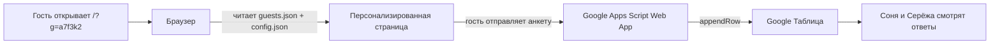

## Что получится

Один лёгкий статический сайт (без сервера и сборки), адаптивный для десктопа и мобильного. Палитра и общий тон — как в `example/IMG_3645.PNG…IMG_3654.PNG`: бордо `#6E1422`, кремовый `#FBEFDD`, пыльно-розовый `#E9CDD0`. Шрифты — `Cormorant Garamond` (заголовки), `Caveat` (рукописные акценты), `Inter` (текст) с Google Fonts.

### Структура страницы (сверху вниз)
- Hero: «СОНЯ и СЕРЁЖА», сердце, фото пары (`couple photos/IMG_0752.JPG`), подпись «Ничего не планируйте на 06.09.2026, потому что мы женимся!»
- Именное обращение: «Дорогая Аня!» / «Дорогие мама и папа!» / fallback «Дорогие друзья и родные!»
- Календарь Сентябрь 2026 с анимированным «бьющимся» сердцем на 6 числе (CSS keyframes)
- Локация: «Ганинская ферма», адрес, фото (`location photo/abukhareva_458_1_1.png.webp`), кнопка «Посмотреть на карте» (Яндекс.Карты)
- Программа дня: 14:00 фуршет → 15:00 церемония → 16:00 ужин → 22:00 окончание (текст появляется по скроллу через `IntersectionObserver`)
- Трансфер: автобус от ст.м. Беговая в 12:45 и обратно
- Пожелания (5 карточек): подарки, цветы, RSVP до 1 августа, контакты организаторов (Полина 8 921 979 68 84, Катя 8 921 632 77 43), глэмпинг (+7 981-889-38-37), удобная обувь
- Дресс-код: палитра 5 кружков + горизонтальная карусель из 7 фото (`dress code example/*.jpg`)
- Обратный отсчёт до 06.09.2026 (живой)
- Анкета (см. ниже)
- Подвал: «Будем очень рады вас видеть! Ваши Соня и Серёжа»

### Анкета и условные поля
Базовые поля: Имя и фамилия, «Будете ли на свадьбе?» (да/нет), пожелания по алкоголю (чекбоксы), аллергии/пищевые ограничения, поедете ли на автобусе от Беговой (да/нет/обратно тоже), комментарий.

Условные поля по типу гостя:
- `family` (родственники) — добавляется вопрос «Нужно ли вам жильё?» (да, в глэмпинге / нет / уточню позже)
- `friend` (друзья) — добавляется свободное поле «Что бы вы хотели нам сказать?»
- `default` — без дополнительных блоков

### Персонализация: один код — один гость
- Ссылка вида `https://сайт/?g=a7f3k2` — 6 случайных символов (base32 без похожих 0/O/1/I), имя гостя в URL не светится
- Все гости описаны в одном файле `guests.json`, ключ — это код, `note` нужно только для своего удобства:

```json
{
  "default":  { "greeting": "Дорогие друзья и родные!", "type": "default" },
  "a7f3k2":   { "greeting": "Дорогая Аня!",            "type": "friend", "note": "Аня Иванова" },
  "x9m4qp":   { "greeting": "Дорогие мама и папа!",    "type": "family", "note": "родители Сони" }
}
```

- JS на старте читает `?g=<код>`, подставляет приветствие и включает/выключает блоки `data-show-for="family"` / `data-show-for="friend"`. Если параметр не передан или код не найден — показывается `default`.
- Код гостя дополнительно отправляется в анкете в скрытом поле `guest_code` — чтобы в Google Таблице было видно, кто конкретно ответил.
- Для удобной генерации новых кодов будет страничка `tools/new-code.html` — открываешь, жмёшь «Сгенерировать», получаешь код и сразу готовый JSON-фрагмент со ссылкой для вставки в `guests.json`.

### Сбор ответов: Google Apps Script → Google Таблица
1. Создаётся таблица «Свадьба — анкета».
2. В ней `Расширения → Apps Script` вставляется небольшой скрипт `doPost(e)`, который добавляет строку с полями (имя, статус, алкоголь, жильё, комментарий, slug гостя, дата отправки).
3. Скрипт деплоится как Web App с доступом «Все» (`Anyone`). Получается URL вида `https://script.google.com/macros/s/AKfy…/exec`.
4. Этот URL вставляется в `config.json` → поле `formEndpoint`.
5. Сайт отправляет анкету через `fetch(... , { method: "POST", mode: "no-cors", body: FormData })`. После успешной отправки показывается экран «Спасибо, ждём вас!».

Готовый скрипт и пошаговая инструкция со скриншотами шагов (текстом) будут лежать в `docs/google-sheets.md`.

### Анимации
- CSS `@keyframes heartbeat` — пульсирующее сердце на дате 6 в календаре и маленькие сердца в hero
- `IntersectionObserver` + класс `.in-view` — плавное появление пунктов программы и карточек пожеланий по скроллу
- Декоративные SVG-завитки из примера (отрисуем как inline SVG) — лёгкое покачивание
- Живой обратный отсчёт (`setInterval`) до `2026-09-06T14:00:00+03:00`
- Карусель дресс-кода — горизонтальный скролл со snap

### Хостинг и домен
- Бесплатный: GitHub Pages. Репозиторий на GitHub, в настройках включается Pages — сайт сразу доступен по `https://<ник>.github.io/<репо>/`.
- Свой домен: покупается на `reg.ru` / `timeweb.ru` / `nic.ru` (~200–700 ₽/год для `.ru`). В DNS прописываются `A`-записи GitHub Pages (`185.199.108.153`, `.109.153`, `.110.153`, `.111.153`) и `CNAME` `www → <ник>.github.io`. В репозитории добавляется файл `CNAME` с доменом. HTTPS включается одной галочкой.

## Структура файлов

```
wedding-invite/
├── index.html             # вся разметка страницы
├── styles.css             # стили + анимации
├── app.js                 # персонализация, анимации, отправка анкеты
├── config.json            # общие данные (дата, локация, телефоны, URL Google-скрипта)
├── guests.json            # список гостей: код → приветствие + тип + note
├── assets/
│   ├── couple/            # обработанные фото пары
│   ├── location/          # фото фермы
│   └── dresscode/         # фото для карусели
├── tools/
│   └── new-code.html      # генератор случайных кодов для новых гостей
├── docs/
│   ├── README.md          # как редактировать сайт
│   ├── google-sheets.md   # как настроить таблицу для анкеты
│   ├── guests.md          # как добавить нового гостя и сформировать ссылку
│   └── domain.md          # как привязать свой домен
└── .gitignore
```

## Поток данных



## Подробный план редактирования сайта после создания

В `docs/README.md` будет пошаговая инструкция на русском, со скринами шагов (текстом). Кратко:

1. **Изменить любой текст** — открыть `config.json` (общие данные) или прямо `index.html` в GitHub через `.` → `Edit` → `Commit`. Через 30–60 секунд изменения уже на сайте.
2. **Заменить картинку** — загрузить новый файл в `assets/...` через кнопку `Add file → Upload files` на GitHub, при необходимости обновить путь в `index.html`.
3. **Изменить анкету** — поля анкеты описаны в `index.html` секцией `<form id="rsvp">`. Чтобы добавить вопрос: скопировать блок поля, поменять `name="..."`, при необходимости пометить `data-show-for="family"`. Колонка в Google Таблице создастся автоматически при следующем ответе (после добавления заголовка в первую строку таблицы).
4. **Посмотреть ответы** — открыть созданную Google Таблицу. Каждый ответ — новая строка. Можно фильтровать (Меню → Данные → Создать фильтр), считать сумму «да»/«нет» через `=COUNTIF`, экспортировать в Excel.
5. **Создать персональную ссылку под гостя** — открыть `tools/new-code.html` (просто двойной клик по файлу или открыть на сайте), нажать «Сгенерировать», скопировать готовый JSON-блок и вставить в `guests.json`, например `"k3p7vn": { "greeting": "Дорогая Катя!", "type": "friend", "note": "Катя с работы" }`. Закоммитить. Дать гостю ссылку `https://<домен>/?g=k3p7vn` — в URL только код, имя не светится. Удобно вести список «код → кому отправили» на отдельном листе «Гости» в Google Таблице.
6. **Свой домен** — пошагово в `docs/domain.md`: купить домен → прописать DNS-записи (4 A-записи и CNAME) → добавить файл `CNAME` в репозиторий → включить HTTPS в Settings → Pages. Полная процедура занимает 15–60 минут (плюс ожидание DNS).

## Что я НЕ делаю в этом плане

- Не настраиваю автоматическую генерацию персональных ссылок (это будет ручной список в `guests.json` — самый простой и прозрачный вариант)
- Не подключаю аналитику (по умолчанию)
- Не использую сборщики (Vite/webpack) — никакой `npm install`, сайт работает «как есть»

## Что нужно от пользователя ПОСЛЕ создания сайта

1. Аккаунт на GitHub (бесплатно) — для хранения и публикации
2. Аккаунт Google — для таблицы с ответами
3. (Опционально) Купленный домен — если хочется не `*.github.io`

Все эти шаги расписаны в `docs/`.